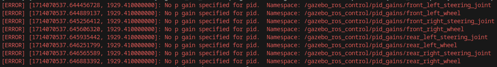
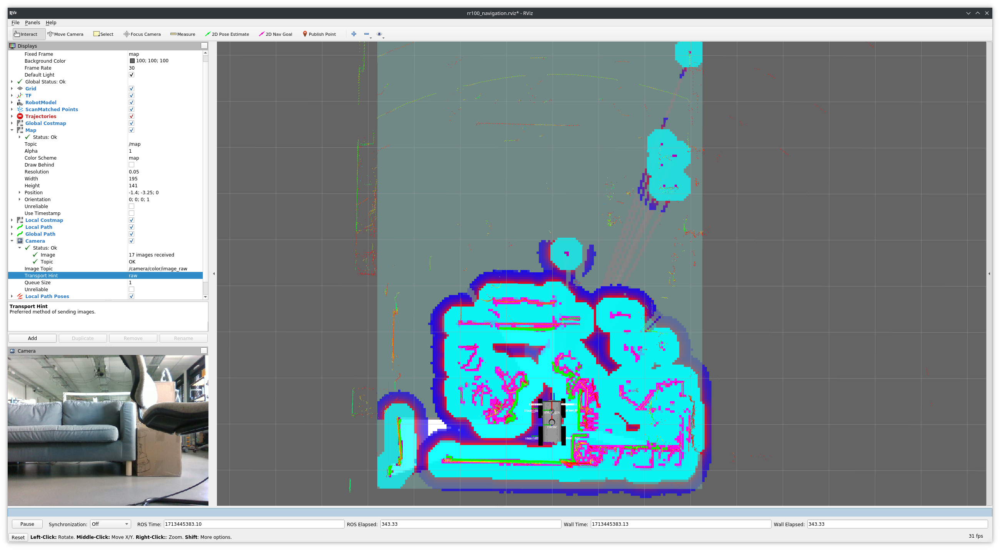

# RR100 Navigation package
## Dependencies
This project should only depend on docker to be built and function. You can see install instructions by following [this link](https://docs.docker.com/engine/install/).

If you want to have access to hardware acceleration inside the container using an nvidia GPU, follow the install instructions for the nvidia-container-toolkit located [here](https://docs.nvidia.com/datacenter/cloud-native/container-toolkit/latest/install-guide.html).

## Building and running the container
First, clone this repository and its submodules :
```console
user@machine:~$ git clone git@github.com:Soralsei/rr100-rhoban.git
user@machine:~$ cd rr100-rhoban
user@machine:~/rr100-rhoban$ git submodule update --init --recursive
```

Next, if you intend to rebuild the image often, in contexts where a good network connection isn't available (or if you don't have access to the internet at all), pull the required parent docker image from dockerhub:
```bash
docker pull ros:noetic
```

Then, for convenience, a bash script (`rr100-rhoban/build_and_run.sh`) to build and run the project is provided at the root of the repository.

Usage example  :
```console
user@machine:~/rr100-rhoban$ ./build_and_run.sh --image-tag rr100-sim --target simulation -g
```

### Script parameters
```
-i, --image-tag <tag-name>              Used to specify the docker image to run/build REQUIRED
-c, --container-name <container-name>   Used to specify the docker container name when running the image, OPTIONAL, default: 'ros'
-r, --rebuild                           Rebuild the image, OPTIONAL, default: false
-t, --target [real, simulation]         The build target, OPTIONAL, default: 'real'
-g, --gpu                               Add GPU support, OPTIONAL, default: false
-h, --help                              Show this message
```

## Running the project
Before we start, if you want to have access to the GUI, it is necessary to give access to your X server to the docker container. To do this, a quick and dirty way would be to add the docker user to the authorized users for your X server by executing `xhost +local:docker`. However, this isn't a safe way of doing this but since we aren't exposing anything to the internet, we can get away with going about it like this. You can also add it to your `.bashrc` to avoid having to retype it on every reboot. 

### In simulation
First, in a first terminal in the container, run the following command :
```bash
roslaunch rr100_gazebo rr100_<empty|playpen>.launch
```
Here, you will get a few errors concerning a missing "p gain" parameter :


However these errors are false positives and won't affect the simulated robot. Nonetheless, if you still wish to remove these error messages, you can add following parameters in the configuration file at `/opt/ros/$ROS_DISTRO/share/rr100_configuration/rr100_control/control.yaml`
```yaml
gazebo_ros_control: 
  pid_gains:
    front_left_steering_joint:
      p: <p value>
      i: <i value>
      d: <d value>
    # front_left_wheel ...
```
> [!WARNING]
> You should nevertheless be advised that these changes are only temporary and will be void every time you rebuild the image or run a new container unless you copy the original package (`rr100_configuration`), modify these files directly then add then to this workspace.

Next, open a new terminal inside the container :
```bash
# Outside of the container, to attach a new terminal to the container
docker exec -ti ros bash
```
Then, run the following command to run the navigation stack without a static map (using the one generated by SLAM) :
```bash
# Inside the container
roslaunch rr100_navigation rr100_navigation.launch \
    cam_point_cloud_enabled:=true \
    cam_point_cloud_topic:=r200/depth/points \
    gps_enabled:=true \
    gps_topic:=ublox_node/fix \
    imu_topic:=imu7/data \
    simulated:=true \
    use_static_map:=false
```
If you have a static map (in the .pgm/.yaml format) **and** a `slam_toolbox` serialized pose graph (.posegraph/.data format) you can avoid generating a new map by setting launch arguments `use_static_map` to **true** and `generate_map` to **false**

You should now have two windows open :
- A Gazebo window with the simulated environment
- The Rviz visualisation window

 

In Rviz, you can then click on the `2D Nav Goal` tool in the top toolbar then click anywhere and drag the arrow in the desired orientation and the navigation stack will do its best to reach this goal.

Here is a brief summary of the arguments used during the launch of the navigation stack :
```bash
cam_point_cloud_enabled:=true               # Use the point cloud computed by the depth camera
cam_point_cloud_topic:=r200/depth/points    # Simulated depth cam topic name
gps_enabled:=true                           # Enable the robot's GPS and use it for the cartography
gps_topic:=ublox_node/fix                   # Topic name of the gps for the simulated robot
imu_topic:=imu7/data                        # Topic name of the imu for the simulated robot
simulated:=true                             # To signify that the robot is simulated
use_static_map:=false                       # To use the map generated by SLAM instead of a static map
```


#### Example


### With the real robot
Before starting, you will need to be able to communicate with the RR100 by using its name (rr-100-07 in our case). For this you can either configure your DNS to provide that name/address translation, or if you're in a rush, you can add these translation to your `/etc/hosts` file like so:
```
# RR100 addresses
192.168.123.123   rr-100-07   # Replace with your local network configuration
192.168.1.102     rr-100-07   # RR100 internal network
```
Alternatively, you can alter the robot's configuration and set its `ROS_IP` environment variable to its IP address (LAN or WLAN depending on which network you're connected to).

Next, because your computer's clock and the robot's computer's clock will most likely not be synchronized, you will need to configure an NTP client to synchronize to the robot's chrony NTP server. 

First, install `chrony`:
```bash
sudo apt install chrony
```
Then, you will have to alter the default `/etc/chrony/chrony.conf` and add either the robot's IP addresses or the robot's name (since we added it to our `hosts` file, this will also work). After that, you will likely have to comment-out the other ntp server pools present in the configuration file :
```
# Use servers from the NTP Pool Project. Approved by Ubuntu Technical Board
# on 2011-02-08 (LP: #104525). See http://www.pool.ntp.org/join.html for
# more information.
## Comment these out #############
#pool 0.ubuntu.pool.ntp.org iburst
#pool 1.ubuntu.pool.ntp.org iburst
#pool 2.ubuntu.pool.ntp.org iburst
#pool 3.ubuntu.pool.ntp.org iburst
##################################
```
Finally, start/restart the chrony service to take these changes into effect:
```
sudo systemctl restart chrony.service
```

To execute the navigation package on the real robot, you must first build the docker image with the target `real` by using the provided script in a similar fashion :
```bash
./build_and_run.sh --image-tag rr100-real --target real -g -a <YOUR IP ADDRESS>
```

With this command, the container should be automatically built and then run. Make sure you're connected to the same network as the robot or directly connected to the robot's hotspot and then, in the newly running container, launch the navigation package like this : 
```bash
roslaunch rr100_navigation rr100_navigation.launch \
    use_pointcloud_to_laserscan_nodelet:=true \
    nodelet_manager:=rslidar_nodelet_manager \
    use_static_map:=false
```

Here is another summary of the parameters used in the previous launch :
```bash
# Launch the point cloud converter as a nodelet for faster data transfers 
# (allows intra process communication and avoids long copy and network transfer operations 
# for inter process communications)
use_pointcloud_to_laserscan_nodelet:=true
nodelet_manager:=rslidar_nodelet_manager    # The name of the nodelet manager that will run the converter
use_static_map:=false                       # Same as before
```

After running the command, an Rviz window will open and you will be able to control the robot remotely like described [previously](#in-simulation) in simulation.

#### Example

