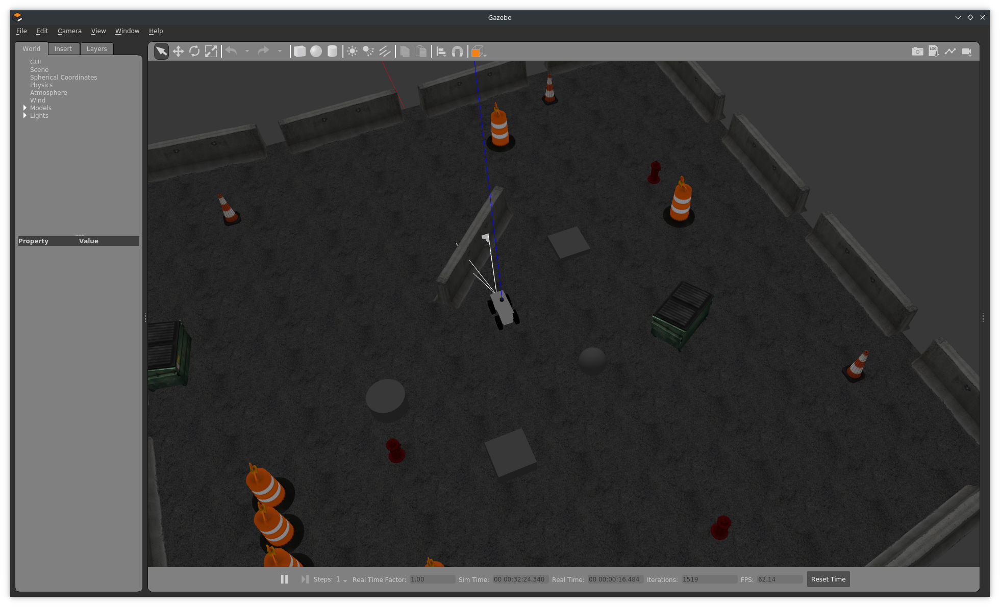
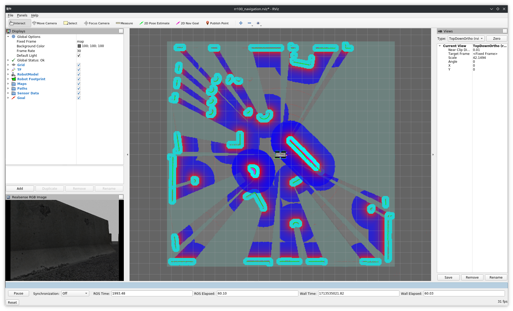
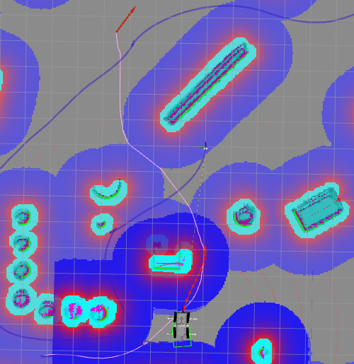

# RR100 Navigation package
## Dependencies
This project should only depend on docker to be built and function. You can see install instructions by following [this link](https://docs.docker.com/engine/install/).

If you want to have access to hardware acceleration inside the container using an nvidia GPU, follow the install instructions for the nvidia-container-toolkit located [here](https://docs.nvidia.com/datacenter/cloud-native/container-toolkit/latest/install-guide.html).

## Building and running the container
First, clone this repository and its submodules :
```console
user@machine:~$ git clone git@github.com:Soralsei/rr100-rhoban.git
user@machine:~$ cd rr100-rhoban
user@machine:~/rr100-rhoban$ git submodule update --init --recursive
```

Next, if you intend to rebuild the image often, in contexts where a good network connection isn't available let alone you have access to the internet at all, pull the required parent docker image from dockerhub:
```bash
docker pull ros:noetic
```

Then, for convenience, a bash script (`rr100-rhoban/build_and_run.sh`) to build and run the project is provided at the root of the repository.

Usage example  :
```console
user@machine:~/rr100-rhoban$ ./build_and_run.sh --image-tag rr100-sim --target simulation -g
```

### Script parameters
```
-i, --image-tag <tag-name>              Used to specify the docker image to run/build REQUIRED
-c, --container-name <container-name>   Used to specify the docker container name when running the image, OPTIONAL, default: 'ros'
-r, --rebuild                           Rebuild the image, OPTIONAL, default: false
-t, --target [real, simulation]         The build target, OPTIONAL, default: 'real'
-g, --gpu                               Add GPU support, OPTIONAL, default: false
-h, --help                              Show this message
```

## Running the project
Before we start, if you want to have access the GUI, it is necessary the give access to your X server to the docker container. To do this, a quick and dirty way would be to add the docker user to the authorized users for your X server by executing `xhost +local:docker`. However, this isn't a safe way of doing this but since we aren't exposing anything to the internet, we can get away with going about it like this. You can also add it to your `.bashrc` to avoid having to retype it on every reboot. 

### In simulation
First, in a first terminal in the container, run the following command :
```bash
roslaunch rr100_gazebo rr100_<empty|playpen>.launch
```

Then, in an another terminal inside the container, run the following command :
```bash
# Outside of the container, to attach a new terminal to the container
docker exec -ti ros bash

# Inside the container
# Simulation
roslaunch rr100_navigation rr100_navigation.launch \
	cam_point_cloud_enabled:=true \                 # Use the point cloud computed by the depth camera
	cam_point_cloud_topic:=r200/depth/points \      # Simulated depth cam topic name
	gps_enabled:=true \                             # Enable the robot's GPS and use it for the cartography
	gps_topic:=ublox_node/fix \                     # Topic name of the gps for the simulated robot
	imu_topic:=imu7/data \                          # Topic name of the imu for the simulated robot
	simulated:=true \                               # To signify that the robot is simulated
	use_static_map:=false                           # To use the map generated by SLAM instead of a static map
```

You should now have two windows open :
- A Gazebo window with the simulated environment
- The Rviz visualisation window




In Rviz, you can then click on the `2D Nav Goal` tool in the top toolbar then click anywhere and drag the arrow in the desired orientation and the navigation stack will do its best to reach this goal.

### Example


