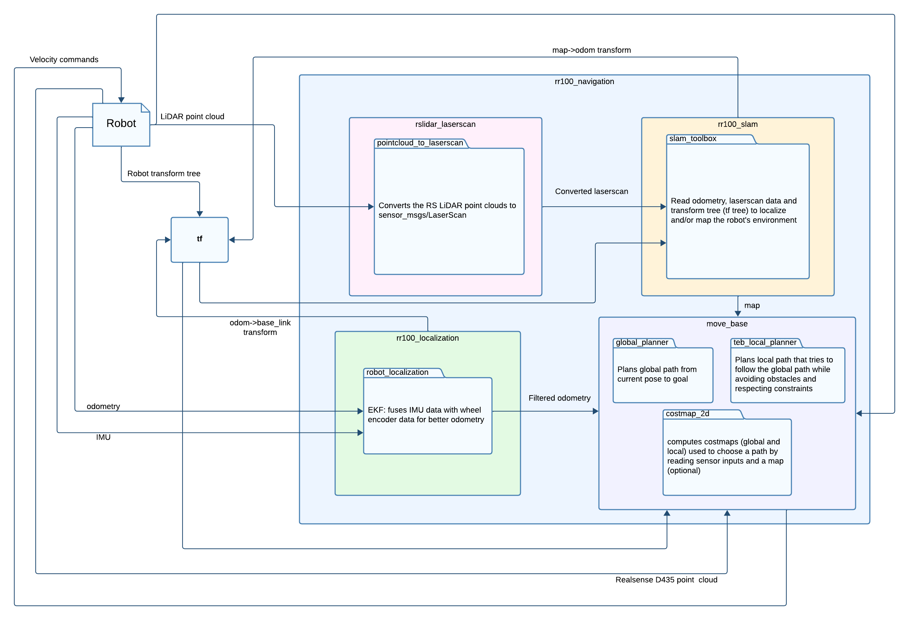
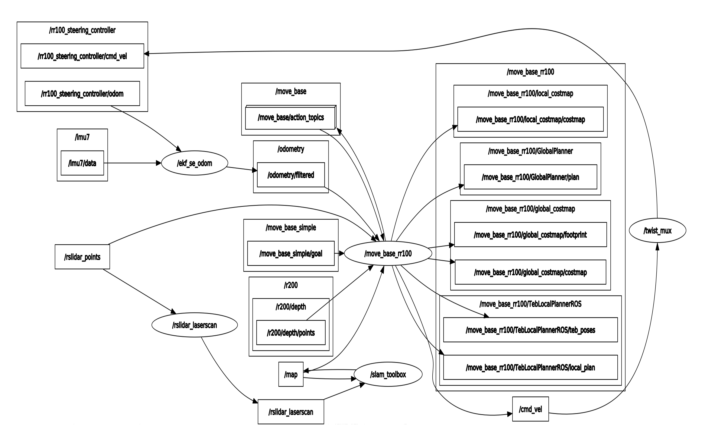

# RR100 Rhoban documentation
<style>
  .figure {
    margin: 12pt auto;
    width: 100%;
    display: flex;
    flex-direction : column;
    justify-content: center;
    align-items: center;
    row-gap: 8pt;
  }
  .figure > p,i {
    font-size: 12pt;
  }
</style>

## Package and tools documentation
- `docker` : https://docs.docker.com/
- `slam_toolbox` : https://github.com/SteveMacenski/slam_toolbox/blob/noetic-devel/README.md#Introduction
- `pointcloud_to_laserscan` : http://wiki.ros.org/pointcloud_to_laserscan
- `move_base` : http://wiki.ros.org/move_base
  - `costmap_2d` : http://wiki.ros.org/costmap_2d
    - `costmap_2d::StaticLayer` : http://wiki.ros.org/costmap_2d/hydro/staticmap
    - `costmap_2d::VoxelLayer` : http://wiki.ros.org/costmap_2d/hydro/obstacles#VoxelCostmapPlugin
    - `costmap_2d::InflationLayer` : http://wiki.ros.org/costmap_2d/hydro/inflation
  - `global_planner` : http://wiki.ros.org/global_planner
  - `teb_local_planner` : http://wiki.ros.org/teb_local_planner
- `robot_localization` : 
  - http://docs.ros.org/en/noetic/api/robot_localization/html/index.html
  - https://github.com/methylDragon/ros-sensor-fusion-tutorial/tree/master


## Docker basics
This section is useful for those who either don't have access to a PC running Ubuntu 18.04 or want to avoid installing every dependency of this project to their computer by keeping it in a standalone container.

### Architecture basics
Docker is based on a client-server architecture with the client talking to a local or remote daemon (`dockerd`) which handles building images, running and distributing containers. These images and containers are called *Docker objects*. 

<div class="figure">
  
  <i>Docker's general architecture (Source: <a href="https://docs.docker.com/get-started/overview/#docker-architecture">Docker's documentation</a>)</i>
</div>

#### Images
An image is a read-only template with instructions for creating a Docker container. Often, an image is based on another image, with some additional customization. For example, you may build an image which is based on the ubuntu image, but installs the Apache web server and your application, as well as the configuration details needed to make your application run.

To create these images, Docker uses its own syntax in files (usually) named `Dockerfile`. Almost every instruction in a Dockerfile creates a new *layer* in the image. When you change the Dockerfile and rebuild the image, *only* the layers that have changed are rebuilt. This includes the layers directly changed  (example: a modified file which is copied to the image with a `COPY` instruction) and every subsequent layer after that one in the same *stage* (which we will describe later).

#### Containers
A container is a runnable instance of an image. You can create, start, stop, move, or delete a container using the Docker API or CLI. You can connect a container to one or more networks, attach storage to it, or even create a new image based on its current state.

By default, a container is relatively well isolated from other containers and its host machine. You can control how isolated a container's network, storage, or other underlying subsystems are from other containers or from the host machine.

A container is defined by its image as well as any configuration options you provide to it when you create or start it. When a container is removed, any changes to its state that aren't stored in persistent storage disappear.

### Using Docker
To build you own image and run containers, you will have to write a Dockerfile and use Docker's command line interface (CLI). This documentation won't guide you on how to go about building your own images but a detailed guide is a available on the online [Docker documentation](https://docs.docker.com/build/guide/). We will however give you the most useful Dockerfile instructions and important Docker CLI commands to know.

#### Dockerfile instructions
One of the first (and usually *the* first) instruction you will encounter in Dockerfiles is the `FROM` instruction. This tells the builder which parent image to inherit from when building your own image. This means we can use pre-existing images (such a the `ros:$ROS_DISTRO` images) to build our applications without having to install create the environment from scratch.

For example, this instructions sets your base image to the 18.04  release of Ubuntu:
```Dockerfile
FROM ubuntu:18.04
```
All subsequent instructions are then executed inside of this base Ubuntu image.
> [!NOTE]
> The notation ubuntu:18.04, follows the name:tag standard for naming Docker images which you will also see in this projects Dockerfile

Another common set of instructions is the `ADD`/`COPY` instructions. These instruction are very similar in that they both copy files into a container but `ADD` has additional functionnality. `ADD` can automatically extract standard compression formats into a container and can also be used to fetch resources from a URL.
> [!TIP]
> You'll mostly want to use `COPY` for copying files from one stage to another in a multi-stage build or if you need files from your build context (your host project files) inside of your containers. `ADD` is best for when you need to download a remote artifact as part of your build and should be used instead of manually fetching files with `wget` or `curl` and `tar`. See the [Best practices for Dockerfile instructions](https://docs.docker.com/develop/develop-images/instructions/#add-or-copy) for more details

Another pair of useful and similar instructions is the `ARG`/`ENV` pair of instructions. `ARG` and `ENV` both declare and assign variables. `ARG` defines a build-time variable that can be used to declare build arguments for the Dockerfile as well as variables that can only be used in the *build* context (meaning that they're out-of-scope when using `RUN` instructions which are executed inside intermediate containers during the build). `ENV` is used to declare and assign **environment variables** in containers and can be used in `RUN` instructions.

> [!NOTE]
> For more information on when to use `ENV`, see [here](https://docs.docker.com/develop/develop-images/instructions/#env)

Finally, one of the most useful (if not *the* most useful) instructions in Dockerfiles is the `RUN` instruction. It is used to execute arbitrary shell commands to create a new layer on top of the current image. The `RUN` instruction is commonly used along `apt`/`apt-get` to install required packages inside images.

> [!WARNING]
> Because every layer in an image increases its final size on disk, it is advised to use as little `RUN` instructions as possible by combining them (with the `&&` shell operator) in a single command. Also the `RUN apt-get` command has several counter-intuitive behaviors to look out for. See [here](https://docs.docker.com/develop/develop-images/instructions/#run) for details

#### Docker CLI
The Docker CLI is used for building images, running containers and managing your Docker local and remote registries (where your docker images are stored). 

##### Building
To build your docker images, you will need to know the `docker build` command. This command takes various arguments with the most commonly used ones being `--tag <name>(?:\:<tag>)?`, `--target <Stage in Dockerfile>` and `--build-arg <ARG_NAME>=<VALUE>`, followed by the path the build context (which should contain your Dockerfile). This will start the building process of your Docker image described by the Dockerfile passed to the command. For a complete overview of this command , you can check out the [official reference](https://docs.docker.com/reference/cli/docker/image/build/) for it.

##### Running containers
To run containers, you will need to use the `docker run` command.
> [!NOTE]
> Under construction

## ROS basics
> [!NOTE]
> Under construction
> 
## Overview of the project
### Package interaction
This project makes use of many packages oriented towards autonomous robot navigation, all of which are standard in the ROS ecosystem. These packages all handle a different aspect of navigation, namely mapping, localizing, and path planning for the robot and we will go over how each of them works in a later section.

For now, let's focus on how each of these packages are integrated in our autonomous navigation package and how they intreact with each other. Below, a diagram illustrates how each package interacts with the robot and the other packages.
<div class="figure" style="width: 95%;">
  
  <i>RR100 navigation package diagram</i>
</div>

First, `rslidar_laserscan` (internally uses `pointcloud_to_laserscan`) takes in point clouds recorded by the RSLiDAR-16 of the robot and converts them to a planar 2D point cloud in the standard ROS format `sensor_msgs/LaserScan`. This converted point cloud is then piped to the SLAM package `slam_toolbox`, which reads the robot's transform tree (more specifically the transform from the base frame to the LiDAR frame and from the odometry frame to the base frame) and the 2D laserscan to compute an occupancy grid used as a map (how this is done will be detailed in a later section) which is then published.

In parallel, `robot_localization` (a pose estimation package built with Kalman filters) takes in wheel encoder odometry data and IMU data published by the robot and fuses these sensor measurements to estimate to robot's pose in the odometry frame and publish this pose to the `tf` tree (which is used by `slam_toolbox`).

Finally `move_base`, which can be subdivided into 3 packages (2 path planning packages and a costmap computing package), uses sensor data, a SLAM or a static map, and the robot's pose estimation to :
- plan a global path towards the goal pose
- plan a local path to follow the global path (which includes unplanned obstacle avoidance)
- compute velocity commands to follow the local path

### Node and topic interaction
<div class="figure" >
  
  <i>Package node graph (without tf connections)</i>
</div>

> [!NOTE]
> Under construction

## Per-package description
> [!NOTE]
> Under construction
### rslidar_laserscan
### rr100_slam
### rr100_localization
### rr100_navigation