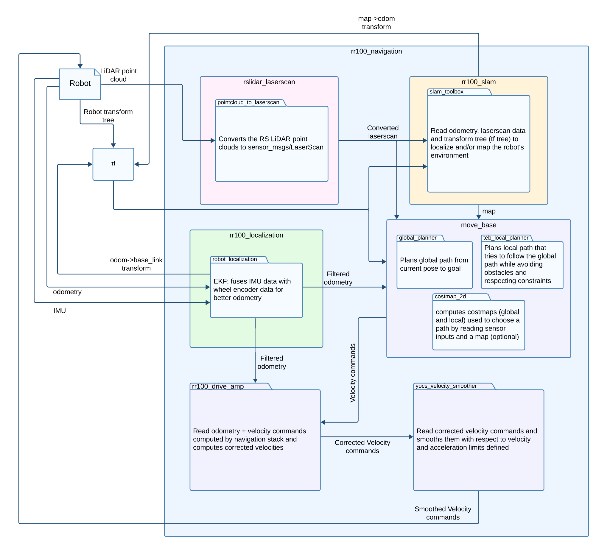
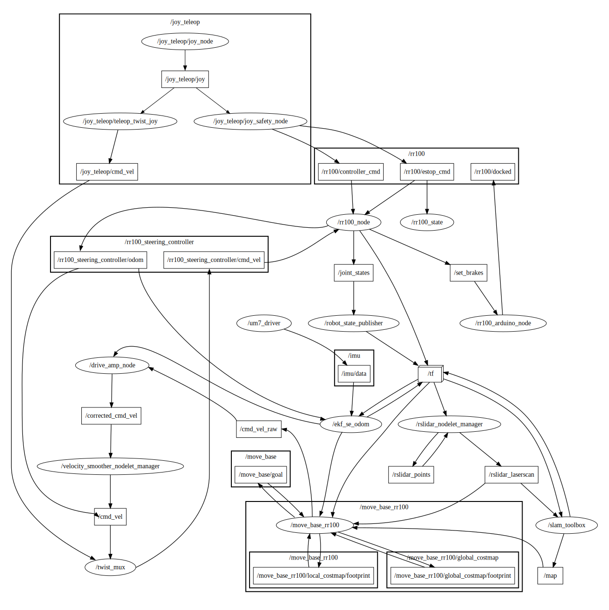

# RR100 Rhoban documentation
<!-- <style>
  .figure {
    margin: 12pt auto;
    width: 100%;
    display: flex;
    flex-direction : column;
    justify-content: center;
    align-items: center;
    row-gap: 8pt;
  }
  .figure > p,i {
    font-size: 12pt;
  }
</style> -->

## Package and tools documentation
- `docker` : https://docs.docker.com/
- `ROS Noetic`
  - https://wiki.ros.org/ROS/Tutorials
  - http://wiki.ros.org/roscpp
  - http://wiki.ros.org/rospy
- `slam_toolbox` : https://github.com/SteveMacenski/slam_toolbox/blob/noetic-devel/README.md#Introduction
- `pointcloud_to_laserscan` : http://wiki.ros.org/pointcloud_to_laserscan
- `move_base` : http://wiki.ros.org/move_base
  - `costmap_2d` : http://wiki.ros.org/costmap_2d
    - `costmap_2d::StaticLayer` : http://wiki.ros.org/costmap_2d/hydro/staticmap
    - `costmap_2d::ObstacleLayer` : http://wiki.ros.org/costmap_2d/hydro/obstacles#ObstacleCostmapPlugin
    - `costmap_2d::InflationLayer` : http://wiki.ros.org/costmap_2d/hydro/inflation
  - `global_planner` : http://wiki.ros.org/global_planner
  - `teb_local_planner` : http://wiki.ros.org/teb_local_planner
- `robot_localization` : 
  - http://docs.ros.org/en/noetic/api/robot_localization/html/index.html
  - https://github.com/methylDragon/ros-sensor-fusion-tutorial/tree/master


## Docker basics
This section is useful for those who aren't familiar with Docker and don't have access to a PC with an Ubuntu version that is incompatible with ROS Noetic (for example Ubuntu 22.04) or want to avoid installing every dependency of this project to their computer by keeping it in a standalone container.
<details>
<summary>Click here to expand</summary>

#### Images
An image is a read-only template with instructions for creating a Docker container. Often, an image is based on another image, with some additional customization. For example, you may build an image which is based on the ubuntu image, but installs the Apache web server and your application, as well as the configuration details needed to make your application run.

To create these images, Docker uses its own syntax in files (usually) named `Dockerfile`. Almost every instruction in a Dockerfile creates a new *layer* in the image. When you change the Dockerfile and rebuild the image, *only* the layers that have changed are rebuilt. This includes the layers directly changed  (example: a modified file which is copied to the image with a `COPY` instruction) and every subsequent layer after that one in the same *stage* (which we will describe later).

#### Containers
A container is a runnable instance of an image. You can create, start, stop, move, or delete a container using the Docker API or CLI. You can connect a container to one or more networks, attach storage to it, or even create a new image based on its current state.

By default, a container is relatively well isolated from other containers and its host machine. You can control how isolated a container's network, storage, or other underlying subsystems are from other containers or from the host machine.

A container is defined by its image as well as any configuration options you provide to it when you create or start it. When a container is removed, any changes to its state that aren't stored in persistent storage disappear.

### Using Docker
To build you own image and run containers, you will have to write a Dockerfile and use Docker's command line interface (CLI). This documentation won't guide you on how to go about building your own images but a detailed guide is a available on the online [Docker documentation](https://docs.docker.com/build/guide/). We will however give you the most useful Dockerfile instructions and important Docker CLI commands to know.

#### Dockerfile instructions
One of the first (and usually *the* first) instruction you will encounter in Dockerfiles is the `FROM` instruction. This tells the builder which parent image to inherit from when building your own image. This means we can use pre-existing images (such a the `ros:$ROS_DISTRO` images) to build our applications without having to install create the environment from scratch.

For example, this instructions sets your base image to the 20.04  release of Ubuntu:
```Dockerfile
FROM ubuntu:20.04
```
All subsequent instructions are then executed inside of this base Ubuntu image.
> [!NOTE]
> The notation ubuntu:20.04, follows the name:tag standard for naming Docker images which you will also see in this project's Dockerfile

Another common set of instructions is the `ADD`/`COPY` instructions. These instruction are very similar in that they both copy files into a container but `ADD` has additional functionality. `ADD` can automatically extract standard compression formats into a container and can also be used to fetch resources from a URL.
> [!TIP]
> You'll mostly want to use `COPY` for copying files from one stage to another in a multi-stage build or if you need files from your build context (your host project files) inside of your containers. `ADD` is best for when you need to download a remote artifact as part of your build and should be used instead of manually fetching files with `wget` or `curl` and `tar`. See the [Best practices for Dockerfile instructions](https://docs.docker.com/develop/develop-images/instructions/#add-or-copy) for more details

Another pair of useful and similar instructions is the `ARG`/`ENV` pair of instructions. `ARG` and `ENV` both declare and assign variables. `ARG` defines a build-time variable that can be used to declare build arguments for the Dockerfile as well as variables that can only be used in the *build* context (meaning that they're out-of-scope when using `RUN` instructions which are executed inside intermediate containers during the build). `ENV` is used to declare and assign **environment variables** in containers and can be used in `RUN` instructions.

Finally, one of the most useful (if not *the* most useful) instructions in Dockerfiles is the `RUN` instruction. It is used to execute arbitrary shell commands to create a new layer on top of the current image. The `RUN` instruction is commonly used along `apt`/`apt-get` to install required packages inside images.

> [!WARNING]
> Because every layer in an image increases its final size on disk, it is advised to use as little `RUN` instructions as possible by combining them (with the `&&` shell operator) in a single command. Also the `RUN apt-get` command has several counter-intuitive behaviors to look out for. See [here](https://docs.docker.com/develop/develop-images/instructions/#run) for details

#### Docker CLI
The Docker CLI is used for building images, running containers and managing your Docker local and remote registries (where your docker images are stored). 

##### Building
To build your docker images, you will need to know the `docker build` command. This command takes various arguments with the most commonly used ones being `--tag <name>(?:\:<tag>)?`, `--target <Stage in Dockerfile>` and `--build-arg <ARG_NAME>=<VALUE>`, followed by the path the build context (which should contain your Dockerfile). This will start the building process of your Docker image described by the Dockerfile passed to the command. For a complete overview of this command , you can check out the [official reference](https://docs.docker.com/reference/cli/docker/image/build/) for it.

Example command:
```console
user@machine:~/hello_world$ docker build --tag hello-world:v1.0.0 .
```

##### Running containers
To run containers, you will need to use the `docker run` command. The `docker run` command runs a command in a new container, pulling the image if needed and starting the container. The command takes the following format `docker run [OPTIONS] <IMAGE> [COMMAND] [ARG...]` and if a command is not specified, Docker only executes the image's `ENTRYPOINT` or `CMD`.
> [!NOTE]
> See [here](https://docs.docker.com/reference/dockerfile/#understand-how-cmd-and-entrypoint-interact) for details about `ENTRYPOINT` and `CMD`. Something that isn't mentioned in the linked section is that docker images inherit `ENTRYPOINT` and `CMD` from its base image.

`docker run` can take many options, with the most common ones being:
- `-i, --interactive` which keeps the containers `STDIN` open to inputs
- `-t, --tty` which creates a pseudo-terminal and attaches it to the container
- `--mount <key>=<value>` which allows you to mount volumes, host-directories, and tmpfs mounts in a container
- `-e, --env <NAME>=<VALUE>` which is used to set environment variables inside of the container.
- `--name NAME` which gives a name to the container that can be used to manage said container.
- `--net, --network=<network>` to connect the container to a specific network (or `host` to use the host's network)
- `-p, --publish (?:<host ip>\:)?<host port>:(?:<container ip>\:)?<container port>` which binds the container's port to the hosts's port on a specific network interface (if specified) or all interfaces.
- `--expose <port>` which exposes the specified container's port without publishing it to the host system's interfaces

Example command:
```console
user@machine:~/hello_world$ docker run -ti --name hello-container bash
```
</details>

## ROS basics
> [!NOTE]
> Under construction

## Project Dockerfile structure
The Dockerfile for this project is structured in a multi-stage manner and inherits from the official Docker `ros:noetic` image. There are in total 3 building stages and 2 target stages in our building process. To optimize build times, we define 2 independent stages `apt-depends` and `cacher` that can be run in parallel by Docker's builder. The former stage's purpose is to download and install dependencies and useful packages for this project. This stage is later used as a base for our `builder` stage that will handle the actual building of this project.

The latter stage (`cacher`) is used to cache `package.xml` files from our project's packages which declare these packages dependencies as they're less likely to change during development :
```Dockerfile
WORKDIR $WORKSPACE/src
COPY src .

# Separate package.xml files in /tmp directory
WORKDIR /opt
RUN mkdir -p /tmp/opt && \
    find . -name "package.xml" | \
    xargs cp --parents -t /tmp/opt && \
    find . -name "CATKIN_IGNORE" | \
    xargs cp --parents -t /tmp/opt || true
```
We copy the source directory to this stage and copy every `package.xml`/`CATKIN_IGNORE` file to a temporary directory while keeping the original source tree structure. In this same stage, we separate dependencies from simulator packages and from actual project packages to be able to compile them in separate docker layers later.

Next comes the `builder` stage that inherits from the `apt-depends` stage. In `builder` we first install the RR100 ROS packages given alongside the robot, then we copy the `package.xml` files from the `cacher` stage into our final workspace and run `rosdep install` to install our packages' dependencies :
```Dockerfile
FROM apt-depends as builder
ARG WORKSPACE

# Install RR100 ros packages
COPY debfiles/* ./debfiles/
RUN python3 debfiles/deploy_debians_noetic.py debfiles

# Install all workspace packages dependencies
WORKDIR ${WORKSPACE}
COPY --from=cacher /tmp/$WORKSPACE/src ./src
RUN . /opt/ros/${ROS_DISTRO}/setup.sh \
    && apt-get update \
    && rosdep update \
    && rosdep install -r -y --from-paths ./src --ignore-src --rosdistro ${ROS_DISTRO} \
    && apt-get upgrade -y \
    && rm -rf /var/lib/apt/lists/*
```

Then, we copy our separated packages and compile them in their own layers to make use of Docker's caching capabilities :

```Dockerfile
# Copy files from cacher stage
COPY --from=cacher $WORKSPACE/src/ .

# Compile dependencies as separate layer for better cache
RUN mv CMakeLists.txt src \
    && . /opt/ros/${ROS_DISTRO}/setup.sh \
    # Copy the simulation packages to the source directory
    && cp -r dependencies/* src \
    # Compile the packages that were in the separation directory
    && ls dependencies | xargs -n 1 basename | xargs catkin_make --only-pkg-with-deps \
    # Delete the separation directory
    && rm -rf dependencies
# ... same for other isolated packages
```

Finally we have the two target stages, `simulation` and `real`. In `simulation`, we keep our `ROS_MASTER_URI` as localhost and in `real`, we set our `ROS_MASTER_URI` to the RR100 robot and our `ROS_IP` to our IP address :
```Dockerfile
# Simulation target
FROM builder as simulation
ENV ROS_MASTER_URI=http://localhost:11311
LABEL target=simulation

# Real robot target
FROM builder as real
ARG IP # Declare that the "IP" build argument will be used 
ENV ROS_MASTER_URI=http://rr-100-07:11311 # Set the container's ROS master to the RR100
ENV ROS_IP=${IP} # Set the container's ROS IP as the build argument passed

LABEL target=real
```
> [!NOTE]
> The `$IP` argument is passed as a build argument by the build_and_run.sh script; else you can define it at the top of the Dockerfile or pass it directly when running `docker build` with `--build-arg IP=<your IP address>`.

## Overview of the project
### Build and run script
> [!NOTE]
> Under construction
<!-- 
1. Parses passed arguments
2. Check if user asked to rebuild
   1. If yes, jump straight to building and running the image
   2. else check if image already exists
      1. if yes, check if build context has changed since last build (files changed or different build target)
         1. if changed, ask user if they want to rebuild and go to building and running if yes and exit if not
      2. else jump ask user if they want ot build this new image and exit if not
3. build image
4. run image
 -->
The project contains a convenience script (located at the root of the project with the name `build_and_run.sh`) for building and running the project with Docker. In this section, we will go over the basics of what that script does, in case one would like to edit it to suit their needs.

The script does a few things when run :
1. The script accepts both short-hand options and long-hand options (`--image-tag` and `-i` for example). Before parsing (due to limitations of the built-in POSIX command `getopts`) the script first needs to convert these long-hand arguments to their equivalent short-hand flags/options. This means that you need to find a unique association between a `--<option>` and a `-<flag>`. For example, the `--image-tag` and the `--ip-address` options of the script both start with the letter 'i' but the `-<flag>` for `--ip-address` is `-a` because `-i` was already associated with `--image-tag`. After this, the script parses the converted arguments with `getopts`.
2. Next, the script checks if the image needs to be rebuilt. For this, it does a few things:
   * if the user passed the `--rebuild`/`-r` option, the script directly goes to rebuilding the image and running it
   * else, it checks if the image with the name passed as an argument exists
     * if it does, it then checks that the image name that was passed to it corresponds to an image built by our Dockerfile (by inspecting the metadata of the image) and finally compares the current build context (ie. the project files copied over to the image) with the one the image was built in by hashing the files in the build context and comparing it to the one in the metadata of the image. If any of these don't match, the script prompts the user for confirmation before rebuilding the image.
     * if it doesn't exist, it asks the user if they want to build it and if they do, the script continues to building and running the image.
3. The script then constructs the build arguments and builds the image
4. Finally, the script runs the image

A more specific explanation on what each part does is available as comments in the script.

Another thing to mention is how the script actually compares builds. You may have noticed the use of labels in the previously described Dockerfile. These labels are used to identify our project's images and store the the hash the build context the image was built in. 

This hash is computed by the script by reading every `COPY` instruction in the Dockerfile from the host to the container and extracting the path to the copied files/directories and hashing all of their content with `sha256sum`. It is then  passed to the docker builder as a build argument and stored as a label (`rhoban.rr100.build.sha`).

When comparing builds, the script uses a python program which extracts any label from the specified docker image and prints it out to standard output (which is captured by the calling shell script) if it exists.

We also store the build target of each build in labels to check if the user changed build targets between consecutive builds. Finally, we also use labels to identify our project's docker images (in the format `"rhoban.image.name"="<name>"`) in order to avoid overwriting one of the user's unrelated docker image (in case they gave an already in-use image name corresponding to an unrelated Dockerfile)

### Package interaction
This project makes use of many packages oriented towards autonomous robot navigation, many of which are standard in the ROS ecosystem. These packages all handle a different aspect of navigation, namely mapping, localizing, and path planning for the robot and we will go over how each of them works in a later section.

For now, let's focus on how each of these packages are integrated in our autonomous navigation package and how they interact with each other. Below, a diagram illustrates how each package interacts with the robot and the other packages.
<div>
  <br>
  <p align="center"><i>RR100 navigation package diagram</i></p>
</div>

First, `rslidar_laserscan` (internally uses `pointcloud_to_laserscan`) takes in point clouds recorded by the RSLiDAR-16 on the robot and converts them to a planar 2D point cloud in the standard ROS format `sensor_msgs/LaserScan`. This converted point cloud is then piped to the SLAM package `slam_toolbox`, which reads the robot's transform tree (more specifically the transform from the base frame to the LiDAR frame and from the odometry frame to the base frame) and the 2D laser scan to compute an occupancy grid used as a map (how this is done will be detailed in a later section) which is then published.

In parallel, `robot_localization` (a pose estimation package built with Kalman filters) takes in wheel encoder odometry data and IMU data published by the robot and fuses these sensor measurements to estimate to robot's pose in the odometry frame and publish this pose to the `tf` tree (which is used by `slam_toolbox`).

Subsequently `move_base`, which can be subdivided into 3 packages (2 path planning packages and a costmap computing package), uses sensor data, a SLAM or a static map, and the robot's pose estimation to :
- compute costmaps (global and local) in a *grid* format which are used by both planners to plan a path towards a goal pose 
- plan a global path towards the goal pose by using the global costmap as a graph and finding the least costly path (in terms of distances and cost on the costmap) from the starting pose node to the goal pose node
- plan a local path to follow the global path (which includes unplanned obstacle avoidance) using the local costmap in a similar fashion to the global planner
- compute velocity commands to follow the local path

These velocity commands are then corrected by the `rr100_drive_amp` package which read our odometry estimations and target velocities (computed by `move_base`) and uses this data to compute corrections (using a PID) to apply to the computed velocities so that our odometry reaches these target velocities.

Finally, `yocs_velocity_smoother` takes in our corrected velocities computed by `rr100_drive_amp` and *smooths* them with respect to our robot's maximum velocities and accelerations (linear and angular).

### Node and topic interaction
> [!NOTE]
> Under construction

Below is a node graph representing the relevant nodes and topics to the robot's navigation stack. 
<div class="figure"> 
  
  <p align="center"><i>Project (simplified) node graph, ellipses represent nodes, outer rectangles represent namespaces and rectangles represent topics</i></p>
</div>

## Per-package description

### rslidar_laserscan
<div>
<pre>
src/rslidar_laserscan/
├── cfg
│   ├── RSLaserScan.cfg
│   └── rslidar16_to_laserscan.yaml
├── CHANGELOG.md
├── CMakeLists.txt
├── include
├── launch
│   ├── rslidar_laserscan.launch
│   ├── rslidar_laserscan_nodelet.launch
│   └── unofficial_rslidar_laserscan.launch
├── nodelets.xml
├── package.xml
├── README.md
└── src
    ├── node.cpp
    ├── nodelet.cpp
    └── rslidar_laserscan.cpp
</pre>
<p align="center"><i>Package structure</i></p>
</div>

The `rslidar_laserscan` package, like mentioned in [Package interaction](#package-interaction), handles `sensor_msgs/PointCloud2` messages conversion to `sensor_msgs/LaserScan` messages. This package makes use of the standard ROS package `pointcloud_to_laserscan`.

The `launch` directory contains every launch file used to configure and launch the nodes/nodelet. When running this package on a distant host, ie. *not* on the robot, it is recommended to use the `rslidar_laserscan_nodelet.launch` launch file. This launch file uses nodelets instead of nodes and registers the point cloud conversion nodelet on the robot's `rslidar_nodelet_manager`. This allows ROS to use *intra-process* communication as opposed to classic *inter-process* transfers that standalone nodes usually use, which results in much greater communication throughput.

> [!NOTE]
> As you may know, point cloud data structures that contain many points are usually quite large, and transferring these over the network at medium (~10Hz) frequencies would require a large portion of the available bandwidth, resulting in a global slow down of ROS.

A custom node/nodelet was also implemented and can be used instead of the standard package but was found to be less effective at converting the point clouds than the standard one. However, this custom node is also dynamically reconfigurable and allows the user to choose a single ring from the LiDAR to use as a planar scan. This custom node can be launched using the provided launch file located at `launch/unofficial_rslidar_laserscan.launch` and `launch/unofficial_rslidar_laserscan_nodelet.launch`

#### Configuration
To configure the package, a configuration file (`rslidar16_to_laserscan.yaml`) can be edited in the `cfg` folder. The parameters currently set should be tailored to the RSLiDAR-16 used on the RR100. However if you want to modify these parameters, an overview of the exposed parameters is available [here](http://wiki.ros.org/pointcloud_to_laserscan#Parameters).

### rr100_localization

This package, like [rr100_slam](#rr100_slam) wraps `slam_toolbox`, is a wrapper package around `robot_localization` which is a data fusion package aimed at localizing robots.

Currently, only one configuration of this package is in use (`ekf_odom.launch` and `ekf_odom.yaml`) which handles localization in the odometric frame. However, another configuration is available which would handle global localization data fusion by fusing global positioning data from `slam_toolbox` and from another global position package like `amcl` or `gmcl`.

This odometric frame data fusion configuration uses an Extended Kalman Filter (or EKF) to estimate the robot's pose by fusing IMU data (specifically angular acceleration) and raw wheel-encoder odometry (and specifically linear velocities and yaw velocity).

#### Configuration
The configuration for localization in the odometry frame is based a template EKF configuration file (`ekf.yaml`) located in the original repository for `robot_localization` on the `noetic-devel` branch. Our configuration file uses mostly default values except on values that directly relate to our RR100 robot or our use case, namely :
- `two_d_mode` => `true`
- `base_link_frame` => `base_footprint`
- `world_frame` => `odom`
- `odom0_config` :

| Field            | x     | y     | z     |
| ---------------- | ----- | ----- | ----- |
| Position         | false | false | false |
| Angle            | false | false | false |
| Velocity         | true  | true  | true  |
| Angular velocity | false | false | true  |
| Acceleration     | false | false | false |

- `imu0_config` :

| Field            | x     | y     | z     |
| ---------------- | ----- | ----- | ----- |
| Position         | false | false | false |
| Angle            | false | false | false |
| Velocity         | false | false | false |
| Angular velocity | true  | true  | true  |
| Acceleration     | false | false | false |

It is possible to tune the results of the data fusion by tweaking the covariance matrices parameters present in the configuration file but as the default values seemed to work fine, they were not tuned.

The `ekf_odom.launch` configuration takes in two arguments:
- `imu_topic`
- `odom_topic`

These two arguments are then used to remap the EKF node subscriptions (`/odom`and `/imu/data` initially) to whichever topic we want (in our case, this would be `/rr100_steering_controller/odom` and `/imu/data`). This is useful when simulating the robot, as the simulation package of the RR100 does not use the same naming scheme for topics as the real one.

### rr100_slam
<div>
<pre>
src/rr100_slam/
├── CMakeLists.txt
├── config
│   ├── mapper_params_localization.yaml
│   └── mapper_params_online_async.yaml
├── launch
│   ├── localization_only.launch
│   ├── online_async.launch
│   └── slam_2d.launch
├── package.xml
└── rviz
</pre>
<p align="center"><i>Package structure</i></p>
</div>

The `rr100_slam` package is a wrapper package around `slam_toolbox` which contains launch files and parameter files used to set up the SLAM/localization nodes for our RR100. The parameter files (in `config/`) use *mostly* default values with the exception of a few parameter, namely :

| Parameter name        | default   | modified       |
| --------------------- | --------- | -------------- |
| `base_frame`          | base_link | base_footprint |
| `ceres_loss_function` | None      | HuberLoss      |
| `mode`*               | mapping   | localization   |

*\* Only in `mapper_params_localization.yaml`, loaded in `localization_only.launch`*

The package exposes 2 modes : SLAM mode and localization-only mode. These two modes are launched and set up by using `slam_2D.launch` (that loads the parameters in `mapper_params_online_async.yaml`) and `localization.launch` (that loads parameters in `mapper_params_localization.yaml`) respectively.

> [!NOTE]
> The author and main maintainer of `slam_toolbox` recommends keeping the default values set in the parameter files as they're good enough for most applications. The list of arguments is available [here](https://github.com/SteveMacenski/slam_toolbox/blob/noetic-devel/README.md#configuration) if you still wish to modify them.

The `slam_2D.launch`launch file runs the online asynchronous SLAM node of the `slam_toolbox` package with the `online_async.launch` file. This node handles incoming laser scans asynchronously with a best-effort policy (meaning that if the node can't meet the frequency of incoming scans, it will drop some of them). An optional argument is available to provide a map in the `.posegraph` format (a serialized map format used by `slam_toolbox`) to this launch file which will allow the SLAM package to continue mapping its environment. See [here](https://github.com/SteveMacenski/slam_toolbox?tab=readme-ov-file#lifelong-mapping) for more information on lifelong mapping.

The `localization_only.launch` runs the localization node of the package which won't create permanent new nodes in the pose graph (meaning that it won't permanently map new spaces if it encounters some) and allows the robot to be manually localized by using Rviz's Pose estimation tool or by publishing a pose on the `/initialpose` topic. In this localization-only mode, providing a serialized map to the localization node is mandatory and one can do so by passing a path leading to a serialized map using the argument `map_path` of the launch file.

In both of these launch files, one can pass the point cloud and laser scan topic as launch arguments, which will be used to launch the point cloud conversion node (in `rslidar_laserscan`) that's also started by the launch files, and to tell `slam_toolbox` what topic to subscribe to to receive the converted laser scans.

The serialized maps can be put anywhere as long as the files are accessible to ROS. To serialize maps generated by `slam_toolbox`, the SLAM node exposes a service (`/slam_toolbox/serialize_map`) which can be called to serialize and save the pose-graph and map. A symmetric service exists to deserialize and load the pose-graph/map (`/slam_toolbox/deserialize_map`). 

To have a better understanding of what the SLAM package exposes (in terms of topics, services and actions) it is highly recommended to read the README of the `slam_toolbox` project.

### rr100_drive_amp
<!-- Package written because at low speed -> robot stalling
Simple PID controller:
  - Reads velocity commands from move_base
  - Reads filtered odometry (fused wheel odom + imu)
  - computes corrected velocity command and publishes
Config in yaml to set PID gains or dynamic reconfigure -->

This package was written to offset at problem at low speeds (during the execution of very sharp turns for example) where the robot would get stuck (probably due to friction).

<div>
<pre>
src/rr100_drive_amp/
├── cfg
│   └── DriveAmp.cfg
├── CMakeLists.txt
├── config
│   └── drive_amp_params.yaml
├── include
├── launch
│   └── drive_amp.launch
├── package.xml
├── scripts
│   ├── conversion.py
│   ├── drive_amp.py
└── src
</pre>
<p align="center"><i>Package structure</i></p>
</div>

`rr100_drive_amp` takes in velocity commands calculated by `move_base` and the filtered odometry (wheel odometry fused with IMU data) then computes corrected velocity commands using a simple PID controller.

The `drive_amp.py` node subscribes to the `~/twist_in` topic for input velocity commands and `~/odom_in` for odometry and publishes the corrected commands to `~/corrected_cmd_vel` by default. These subscriptions/publications are remapped to topics passed as arguments to the provided launch file (`launch/drive_amp.launch`).

There are multiple ways to configure the package :
1. Edit the PID gains in `config/drive_amp_params.yaml`
2. Use `rqt_reconfigure` to dynamically change the PID gains

The correction node can also dynamically be activated and deactivated using `rqt_reconfigure`. When deactivated, the node simply forwards the latest velocity command it received and skips the PID control loop altogether.

The current PID gain values are serviceable with our RR100 but could probably be further tuned for better results. For this, one could use `rqt_plot` to visualize velocity commands, corrected velocities and odometry while editing PID gains with `rqt_reconfigure`.

### yocs_velocity_smoother
Because the package `rr100_drive_amp` has no idea what the robot's maximum acceleration and velocities are, it was necessary to limit and smooth the corrected velocity commands that were output by it. 

This is where the `yocs_velocity_smoother` package comes into play. This takes incoming velocity commands and smooths them out while respecting the velocity and acceleration limits it takes as parameters.

The acceleration and velocity limits have been edited to suit our RR100 and should work out of the box. If you still wish to change these parameters around, they are located in `yocs_velocity_smoother/param/rr100_smoother.yaml`.

The parameters can also be dynamically edited using `rqt_reconfigure`.

### rr100_navigation
<!-- TODO -->
> [!NOTE]
> Under construction